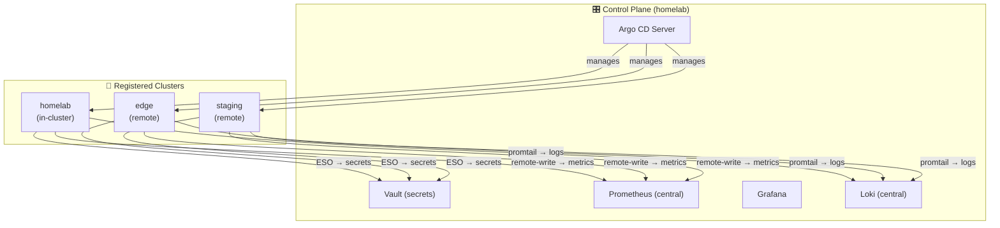
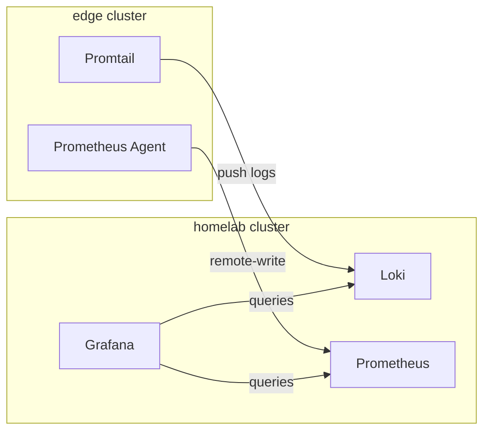

# Multi-Cluster Architecture

This document describes the **Cluster Generator Pattern** for scaling this homelab to multiple Kubernetes clusters while maintaining a single Argo CD control plane.

---

## Overview



### Key Concepts

| Concept | Description |
|---------|-------------|
| **Control Plane** | Single Argo CD instance in `homelab` cluster manages all clusters |
| **Cluster Secrets** | Each remote cluster is registered via a `Secret` with label `argocd.argoproj.io/secret-type: cluster` |
| **Matrix Generator** | ApplicationSets use `cluster × git` matrix to generate apps per cluster |
| **Values Overlay** | Base `values.yaml` + cluster-specific `values-<cluster>.yaml` for customization |
| **App Selection** | `clusters: []` field in `config.json` controls which clusters receive each app |

---

## Directory Structure

```
kubernetes/
├── bootstrap/
│   ├── root.yaml                        # Root app-of-apps (unchanged)
│   └── clusters/                        # NEW: Cluster registration
│       ├── kustomization.yaml           # Aggregates all cluster secrets
│       ├── homelab.yaml                 # In-cluster (optional, implicit)
│       └── edge-k8s.yaml                # Remote cluster via ExternalSecret
│
├── projects/
│   ├── platform.yaml                    # MODIFIED: Matrix generator
│   ├── monitoring.yaml                  # MODIFIED: Cluster filter
│   └── ...
│
└── apps/
    └── platform/
        └── vault/
            ├── Chart.yaml
            ├── config.json              # MODIFIED: Add clusters field
            ├── values.yaml              # Base values (shared)
            ├── values-homelab.yaml      # Homelab-specific overrides
            └── values-edge.yaml         # Edge-specific overrides
```

---

## Cluster Registration

Cluster credentials are stored in Vault and synced to Argo CD via External Secrets Operator. This ensures:
- No plaintext credentials in Git
- Automatic token rotation via ESO refresh
- Centralized credential management

### ExternalSecret for Cluster Credentials

```yaml
# kubernetes/bootstrap/clusters/edge-k8s.yaml
apiVersion: external-secrets.io/v1beta1
kind: ExternalSecret
metadata:
  name: edge-k8s-cluster
  namespace: argocd
spec:
  refreshInterval: 1h
  secretStoreRef:
    name: vault-backend
    kind: ClusterSecretStore
  target:
    name: edge-k8s
    template:
      metadata:
        labels:
          argocd.argoproj.io/secret-type: cluster
          # Custom labels for ApplicationSet filtering
          env: edge
          tier: production
          region: hcm
      type: Opaque
      data:
        name: edge-k8s
        server: https://192.168.74.10:6443
        config: |
          {
            "bearerToken": "{{ .token }}",
            "tlsClientConfig": {
              "insecure": false,
              "caData": "{{ .ca }}"
            }
          }
  data:
    - secretKey: token
      remoteRef:
        key: secret/clusters/edge-k8s
        property: token
    - secretKey: ca
      remoteRef:
        key: secret/clusters/edge-k8s
        property: ca
```

### How It Works

1. **Vault** stores cluster credentials at `secret/clusters/<cluster-name>`
2. **ESO** syncs credentials to a Kubernetes Secret in `argocd` namespace
3. **Argo CD** discovers the cluster via the `argocd.argoproj.io/secret-type: cluster` label
4. **ApplicationSets** can filter clusters by custom labels (`env`, `tier`, `region`)

### Creating Cluster ServiceAccount

On the remote cluster, create a ServiceAccount with cluster-admin permissions:

```yaml
# Run on the REMOTE cluster (edge-k8s)
apiVersion: v1
kind: ServiceAccount
metadata:
  name: argocd-manager
  namespace: kube-system
---
apiVersion: rbac.authorization.k8s.io/v1
kind: ClusterRoleBinding
metadata:
  name: argocd-manager-role
roleRef:
  apiGroup: rbac.authorization.k8s.io
  kind: ClusterRole
  name: cluster-admin
subjects:
  - kind: ServiceAccount
    name: argocd-manager
    namespace: kube-system
---
apiVersion: v1
kind: Secret
metadata:
  name: argocd-manager-token
  namespace: kube-system
  annotations:
    kubernetes.io/service-account.name: argocd-manager
type: kubernetes.io/service-account-token
```

Extract and store in Vault:

```bash
# Get the token
TOKEN=$(kubectl get secret argocd-manager-token -n kube-system -o jsonpath='{.data.token}' | base64 -d)

# Get the CA cert (already base64 encoded)
CA=$(kubectl get secret argocd-manager-token -n kube-system -o jsonpath='{.data.ca\.crt}')

# Store in Vault
vault kv put secret/clusters/edge-k8s token="$TOKEN" ca="$CA"
```

### Vault Path Structure

```
secret/
└── clusters/
    ├── edge-k8s/
    │   ├── token       # ServiceAccount token with cluster-admin
    │   └── ca          # Base64-encoded CA certificate
    └── staging-k8s/
        ├── token
        └── ca
```

---

## Config.json Schema

### Current (Single Cluster)

```json
{
  "name": "vault",
  "srcPath": "kubernetes/apps/platform/vault"
}
```

### Extended (Multi-Cluster)

```json
{
  "name": "vault",
  "srcPath": "kubernetes/apps/platform/vault",
  "namespace": "platform",
  "clusters": ["homelab", "edge"],
  "clusterOverrides": {
    "edge": {
      "valuesFile": "values-edge.yaml"
    }
  }
}
```

| Field | Type | Required | Description |
|-------|------|----------|-------------|
| `name` | string | ✅ | Application name |
| `srcPath` | string | ✅ | Path to Helm chart |
| `namespace` | string | ❌ | Target namespace (default: project name) |
| `clusters` | string[] | ❌ | Clusters to deploy to (default: all) |
| `clusterOverrides` | object | ❌ | Per-cluster configuration |

---

## ApplicationSet with Matrix Generator

```yaml
# kubernetes/projects/platform.yaml
apiVersion: argoproj.io/v1alpha1
kind: AppProject
metadata:
  name: platform
  namespace: argocd
spec:
  description: Platform services
  sourceRepos:
    - '*'
  destinations:
    - namespace: platform
      server: '*'
    - namespace: argocd
      server: '*'
  clusterResourceWhitelist:
    - group: '*'
      kind: '*'
---
apiVersion: argoproj.io/v1alpha1
kind: ApplicationSet
metadata:
  name: platform
  namespace: argocd
spec:
  goTemplate: true
  goTemplateOptions: ["missingkey=error"]
  generators:
    - matrix:
        generators:
          # Generator 1: All registered clusters
          - clusters:
              selector:
                matchLabels: {}
          # Generator 2: Apps from Git
          - git:
              repoURL: https://github.com/khiemnd/homelab.git
              revision: HEAD
              files:
                - path: kubernetes/apps/platform/*/config.json
  template:
    metadata:
      name: '{{ .name }}-{{ .nameNormalized }}'
    spec:
      project: platform
      source:
        repoURL: https://github.com/khiemnd/homelab.git
        targetRevision: HEAD
        path: '{{ .srcPath }}'
        helm:
          valueFiles:
            - values.yaml
            - 'values-{{ .nameNormalized }}.yaml'
      destination:
        server: '{{ .server }}'
        namespace: '{{ default "platform" .namespace }}'
      syncPolicy:
        automated:
          prune: true
          selfHeal: true
        syncOptions:
          - CreateNamespace=true
```

### Filtering Apps by Cluster

Use `templatePatch` to skip apps not intended for a cluster:

```yaml
spec:
  # ... generators and template above ...
  templatePatch: |
    {{- if and .clusters (not (has .nameNormalized .clusters)) }}
    metadata:
      name: ""
    {{- end }}
```

This skips generation when the cluster name is not in the app's `clusters` array.

---

## Cluster-Specific Values

### Base Values (shared)

```yaml
# kubernetes/apps/platform/vault/values.yaml
replicaCount: 1
image:
  repository: hashicorp/vault
  tag: "1.15.0"
resources:
  requests:
    cpu: 100m
    memory: 128Mi
ingress:
  enabled: true
  className: cloudflare-tunnel
```

### Homelab Override

```yaml
# kubernetes/apps/platform/vault/values-homelab.yaml
replicaCount: 1
resources:
  limits:
    cpu: 1000m
    memory: 1Gi
ingress:
  hosts:
    - host: vault.0xk3m.dev
server:
  standalone:
    enabled: true
```

### Edge Override

```yaml
# kubernetes/apps/platform/vault/values-edge.yaml
# Edge cluster runs Vault Agent only, pointing to central Vault
replicaCount: 1
resources:
  limits:
    cpu: 250m
    memory: 256Mi
server:
  standalone:
    enabled: false
  ha:
    enabled: false
injector:
  enabled: true
  externalVaultAddr: https://vault.0xk3m.dev
```

---

## App Placement Matrix

| App | homelab | edge | staging | Notes |
|-----|:-------:|:----:|:-------:|-------|
| **vault** | ✅ Server | ✅ Agent | ✅ Agent | Central Vault in homelab |
| **external-secrets** | ✅ | ✅ | ✅ | Each cluster syncs from Vault |
| **cilium** | ✅ | ✅ | ✅ | CNI required everywhere |
| **metrics-server** | ✅ | ✅ | ✅ | HPA requires this |
| **prometheus** | ✅ Full | ❌ | ❌ | Central in homelab |
| **promtail** | ✅ | ✅ | ✅ | Ship logs to central Loki |
| **grafana** | ✅ | ❌ | ❌ | Central dashboard |
| **loki** | ✅ | ❌ | ❌ | Central log storage |
| **cloudflare-tunnel** | ✅ | ✅ | ❌ | Edge needs ingress |
| **open-webui** | ✅ | ❌ | ❌ | Only in homelab |
| **redis** | ✅ | ✅ | ✅ | Local instance per cluster |

---

## Cross-Cluster Concerns

### Observability



- **Logs**: Promtail on each cluster → pushes to central Loki in homelab
- **Metrics**: Prometheus Agent on remote clusters → remote-write to central Prometheus

### Secrets

Each cluster runs ESO with its own Kubernetes auth to Vault:

```
Vault Auth Methods:
├── kubernetes/homelab  (role: eso-homelab)
├── kubernetes/edge     (role: eso-edge)
└── kubernetes/staging  (role: eso-staging)
```

Terraform module for per-cluster Vault auth:

```hcl
# terraform/vault/modules/k8s_auth/main.tf
resource "vault_auth_backend" "kubernetes" {
  type = "kubernetes"
  path = "kubernetes/${var.cluster_name}"
}

resource "vault_kubernetes_auth_backend_config" "config" {
  backend            = vault_auth_backend.kubernetes.path
  kubernetes_host    = var.kubernetes_host
  kubernetes_ca_cert = var.kubernetes_ca_cert
}

resource "vault_kubernetes_auth_backend_role" "eso" {
  backend                          = vault_auth_backend.kubernetes.path
  role_name                        = "eso"
  bound_service_account_names      = ["external-secrets"]
  bound_service_account_namespaces = ["platform"]
  token_policies                   = ["eso-read"]
  token_ttl                        = 3600
}
```

---

## Implementation Checklist

### Phase 1: Cluster Infrastructure

- [ ] Provision new cluster (Terraform `talos` stack or separate)
- [ ] Create Vault path `secret/clusters/<cluster-name>` with token + CA
- [ ] Add ExternalSecret for cluster credentials in `kubernetes/bootstrap/clusters/`
- [ ] Verify Argo CD can connect: `argocd cluster list`

### Phase 2: ApplicationSet Migration

- [ ] Update `config.json` schema — add `clusters: []` field
- [ ] Update all existing `config.json` files — default to `["homelab"]`
- [ ] Modify ApplicationSet generators — matrix generator
- [ ] Add cluster-specific values files — start with empty overrides
- [ ] Add `templatePatch` for cluster filtering

### Phase 3: Vault Multi-Cluster Auth

- [ ] Add Terraform module for per-cluster Kubernetes auth
- [ ] Configure ESO on each cluster with cluster-specific auth
- [ ] Test secret sync from Vault to each cluster

### Phase 4: Observability

- [ ] Configure Promtail on remote clusters → push to central Loki
- [ ] Configure Prometheus Agent → remote-write to central Prometheus
- [ ] Add Grafana datasources for multi-cluster view

### Phase 5: Test & Validate

- [ ] Deploy test app to specific clusters only
- [ ] Verify cluster-specific values applied correctly
- [ ] Test sync/prune behavior across clusters
- [ ] Verify apps NOT in cluster's list are NOT deployed

---

## Troubleshooting

### Cluster not appearing in Argo CD

```bash
# Check cluster secret exists
kubectl get secret -n argocd -l argocd.argoproj.io/secret-type=cluster

# Check ESO sync status (if using ExternalSecret)
kubectl get externalsecret -n argocd edge-k8s-cluster -o yaml

# Test connection manually
argocd cluster list
argocd cluster get edge-k8s
```

### App not deploying to expected cluster

1. Check `config.json` has the cluster in `clusters` array
2. Check ApplicationSet generator output:
   ```bash
   argocd appset get platform -o yaml
   ```
3. Check `templatePatch` logic isn't filtering incorrectly

### Values file not found

Helm will fail if `values-<cluster>.yaml` doesn't exist. Options:
- Create empty file: `touch values-<cluster>.yaml`
- Use `ignoreMissingValueFiles: true` in ApplicationSet template

```yaml
source:
  helm:
    valueFiles:
      - values.yaml
      - 'values-{{ .nameNormalized }}.yaml'
    ignoreMissingValueFiles: true
```

---

## References

- [Argo CD Cluster Generator](https://argo-cd.readthedocs.io/en/stable/operator-manual/applicationset/Generators-Cluster/)
- [Argo CD Matrix Generator](https://argo-cd.readthedocs.io/en/stable/operator-manual/applicationset/Generators-Matrix/)
- [External Secrets Operator](https://external-secrets.io/)
- [Vault Kubernetes Auth](https://developer.hashicorp.com/vault/docs/auth/kubernetes)
